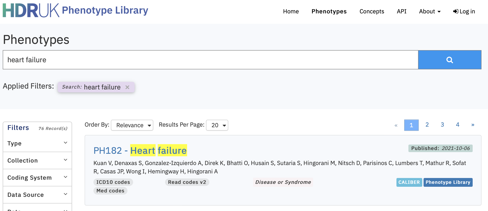

<style>
body{text-align: justify}
</style>
```{r, include = FALSE}
knitr::opts_chunk$set(
  collapse = TRUE,
  comment = "#>", 
  warning = FALSE,
  error = FALSE,
  message = FALSE
)
```
## Setup
```{r setup}
library(ConceptLibraryClient)
library(dplyr)
```

## Phenotypes
We can use the [HDR-UK Phenotypes](https://phenotypes.healthdatagateway.org) library to search for
curated Electronic Health Record code lists that have been curated to represent the 'Heart Failure'
phenotype.

Using the online search we find nine existing phenotype libraries with the ids: `c("PH25","PH531","PH182","PH1028","PH968","PH993","PH631","PH687","PH530")`.

```{r hdr_uk_search, echo=FALSE, out.width=600, fig.align="center"}

```

## Connect to the API
```{r find_hf_codes}
# Connect to HDR-UK Phenotypes API
client = connect_to_API(public=TRUE)

# Get ids and versions of phenotype previously defined (via online search for 'Heart Failure')
ids_version = data.frame("id"     = c("PH25", "PH531", "PH182", "PH1028", "PH968", "PH993", "PH631", "PH687", "PH530"),
                         "version"= c("50", "1062", "364", "2265", "2146", "2171", "1262", "1374", "1060"))

# Recursively extract the phenotype details from the 9 studies
details <- purrr::map2_df(.x = ids_version$id, 
                          .y = ids_version$version, 
                          .f = ~get_phenotype_detail_by_version(.x, .y, api_client=client)) |>
  dplyr::select(phenotype_id, phenotype_name, type)

# View the study details
kableExtra::kable(details)

# Recursively extract the codes and details 
codes <- purrr::map_df(.x = ids_version$id, 
                       .f = function(x){
                        code_list <- get_phenotype_code_list(x, api_client=client)
                        extract   <- data.frame("code"           = code_list$code,
                                                "coding_system"  = code_list$coding_system,
                                                "phenotype_name" = code_list$phenotype_name,
                                                "concept_name"   = code_list$concept_name,
                                                "description"    = code_list$description)
                        return(extract)})

# Make coding system a factor and arrange so that SNOMED codes first
codes <- codes |> 
  dplyr::mutate(coding_system = factor(coding_system, levels = c("SNOMED  CT codes",
                                                                 "Read codes v2",
                                                                 "OXMIS codes",
                                                                 "Med codes",
                                                                 "ICD10 codes",    
                                                                 "ICD9 codes"))) |>
  dplyr::arrange(coding_system) |>
  dplyr::distinct(code, .keep_all=TRUE)
  
# View the study details
kableExtra::kable(codes)
```
